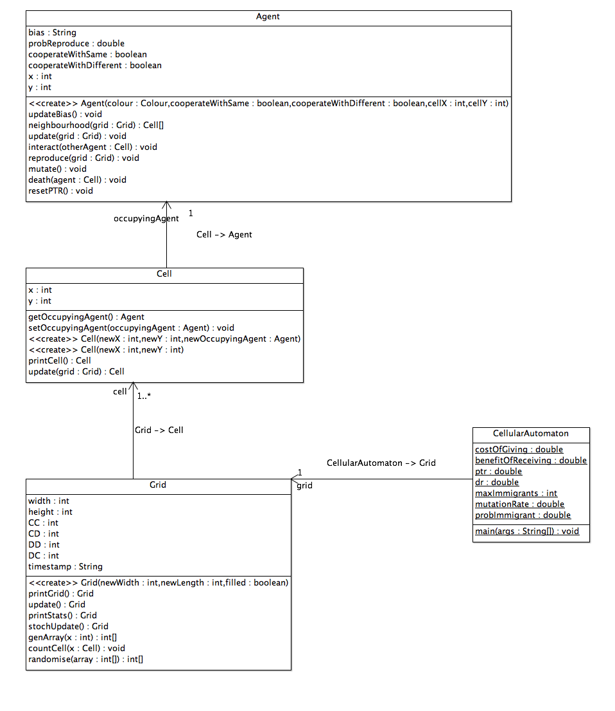

%SWEN40004 - Modelling Complex Software Systems
%Naser Soueid 359161 & Edward Crupi 538156

#Aims
The aim of this study is to examine the similarities and differences in behaviour of two software implementations of the Ethnocentrism model first described by Ross Axelrod and Ross Hammond ([2003](#references)). The first model examined is a NetLogo implementation that is included as part of the NetLogo model library, the second is our own implementation, written in Java and is an attempt to replicate the first NetLogo model. Both implementations are examined statistically to try and discern if they can be determined to follow a normal distribution via Shapiro Wilks tests, and if they appear to represent the same underlying solution set using Mann-Whitney testing. Finally the outputs are also examined as line graphs of multiple runs and as histograms to verify the results of these tests visually.

#Background
Ethnocentrism is a set of attitudes and behaviours ubiquitous in our world, manifested in the formation of communities, nationalistic zeal, and similar examples of collective action based on like individual's mutually recognized common identity. Ethnocentrism refers to the tendency to cooperate with members of the same ethnic type and to avoid cooperating with members of another ethnic type. It has been said that the world peace's biggest threat is the 'clash of civilizations' ([Huntington, 1996](#references)). This makes Axelrod & Hammond's model and the notion of ethnocentrism itself a particularly interesting domain. The model aims to represent the emergent cooperation strategies in areas where different ethnicities coexist.

##Agents
In the world of the Ethnocentrism model there are 4 distinct strategies an Agent may adopt during it's existance:

- Ethnocentrism: Co-operate only with agents of the same type (here our types are colours) and defect from different types. CD
- Egoism: Co-operate with no one, defect from everyone. DD
- Cosmopolitan: Co-operate only with agents of different types, defect from own type. DC
- Altruism: Co-operate with all agents, defect from no one. CC

##Complexity
The model is a complex system, it can be described as such due to four defining properties: Emergence, Self-Organization, Decentralization and propensity for Feedback.  The model shows emergent grouping of ethnic behaviour that organizes itself from the simple evolutionary rules of local competition between individuals. The model is a decentralized (agent-based, each agent is autonomous) cellular-automaton where there is no single controller or 'leader' that is sensitive to fluctuations in group size based on the size of the grid. It is due to this emergent, self-organizing, decentralized behaviour and sensitivity to feedback that the model may be described as a complex system. 

#Model Design
The NetLogo model has many reporting functions that it uses to show the state of the system at any given passed moment in time. The main variables being reported were the number CC, CD, DD and DC agents extant within the system and our design will try and mimic this by also reporting these values

##Overview
The model evolves with one-move Prisoner's Dilemma type interactions ([Rapoport & Chammah,1970](#references)) occuring at every step, where there is a price to be payed in helping someone whilst also conversely a benefit to be gained in being helped by someone. To replicate the model in Java a CellularAutomaton class was created that was comprised of a Grid instance than contained many Cell insctances that may or may not (depending on input) have occupying Agent instance. A UML interpretation of the system is shown below.

##UML Diagram

\

\centerline{Figure 1. The System's Class Diagram}

##Implementation
There are 5 main methods within our model of Ethnocentrism that determines the final state of the model at any given step. They are:

1. Immigration, agents will immigrate to empty cells at a rate determined by the class variable: probImmigrant (probability of immigrant.
2. Interaction, agents will interact with other agents with whom they co-operate within their Von Neumann neighbourhood.
3. Reproduction, agents will reproduce with a likelihood determined by the class variable: `PTR` (potential to reproduce)
4. Death, agents will die out at a rate determined by the class variable: `dr` (death rate)
5. Report Results, statistics are reported and in our Java model's instance saved to a comma separated values (CSV) file.

Each step itself must iterate over all the agents and perform its necessary function to update the state of the system.

##Modelling Techniques
Our system uses a reporting method that outputs the numbers of Ethnocentric, Cosmopolitan, Egoistic and Altruistic agents as 4 respective variables: `CD`, `DC`, `DD` and `CC`. These are the main variables we use to compare our models for similarity of output.

#Experimentation
We explore the following hypotheses:

1. The results from the Java implementation are robust against a change from deterministic updating (top left to bottom right) to stochastic updating.
2. The Java implementation will produce output consistent with the NetLogo implementation.

We are operating under the hypothesis that there will be little difference in the two updating methods in scenarious with fairly densely populated grids. Deterministic updating may lead to population clusters around the top of the grid where the evolving populations are small, thus starting with an empty grid, relatively high death rates, low immigration allowances relative to the maximum number of agents and low probabilities of reproduction are more likely to manifest this behaviour. If there are any differences between the two updating methods, they are likely to be more blatent at these parameter values and thus easier to test for.

All tests will be run only on the number of Ethnocentrists at tick 350. Through repeated observation of the output of all three variations of the model tested, this appers to represent a sufficiently stable, representative point in the output. Due to experimental limitations, testing on the number of the other three classes is done only between the NetLogo model and the Java implementation to give some insight into whether they are consistent. 

#Results
##Analysing the Output
###Experiment 1: Deterministic vs. Stochastic Updating
The updating method used by NetLogo is not explicitly stated. Here we see if a change in updating method results in a systematic change in the output of our Java model, and then explore which, if either, produce results more statistically similar to the NetLogo model.

Below are comparisons of the output of our Java model using NetLogo's default parameter settings, starting with an empty grid:

```
mutation-rate 								= .0050
death-rate									= .1
immigrants-per-day 							= 1
immigrant-chance-cooperate-with-same 		= .5
immigrant-change-cooperate-with-different	= .5
initial-PTR									= .12
cost-of-giving								= .01
gain-of-receiving							= .03
```

\
\centerline{Figure 2. Comparison of Model Outputs}

A comparison of the frequency histograms as well as the Mann-Whitney test reveals that at the default settings (with the initial state of the system unpopulated and a limit of 1 immigrant per turn) on a 30x30 space reveals that the results are significantly different. Our results imply that stochastic updating matches the behaviour of the NetLogo implementation more closely. 

We repeated this test with a fully populated grid and found that, contrary to our expectation, a comparison of the relevant histograms as well as the results of a Mann-Whitney test of the output from Deterministic vs Stochastic updating reveals that the resulting distributions of generated values are significantly different.

Null Hypothesis: Java Deterministic Updating = Java Stochastic Updating
two-tailed p-value: 0.045714198

Null Hypothesis: NetLogo Model = Java Deterministic Updating
two-tailed p-value: 0.000140141

Null Hypothesis: Netlogo Model = Java Stochastic Updating
two-tailed p-value: 2.99294E-08

The results above reveal that the implementation with stochastic updating generates output that more closely matches the output from the NetLogo model.


##Experiment 2: NetLogo vs. Java with Stochastic Updating
###Default values
Using the default values defined in the previous section resulted in a normally distributed range of values after 350 ticks with similar means and variances. Mann-Whitney testing indicates that both sets of data represent the same underlying distribution at a confidence level of 0.01.

Mann-Whitney enforces the null hypothesis.
Two-tailed p-value: 2.99294E-08

Histograms:


###Joint Parameter Variation
Here we test the two models given four sets of parameters. We have tried to include parameter values that may represent communities with certain traits, such as predominantly immigration driven communities or insular communities, as well as values that represent unrealistic scenarios at the ends of the paramater's bounds.

Null hypothesis:
- Observations derived from same distribution

a) 

Where reproduction is based heavily on cooperation relative to other factors 

```
mutation-rate                               = .0050
death-rate                                  = .1
immigrants-per-day                          = 1
initial-PTR                                 = .01
cost-of-giving                              = .12
gain-of-receiving                           = .24
```

The output of the models diverge slightly. Both lose their normality, with the NetLogo model returning a higher mean number of ethnocentrics relative to the Java implementation. 

Mann-Whitney enforces the null hypothesis.
Two-tailed p-value: 3.69074E-18

Histograms:

b) 

Where birth and mutation are the dominant factors

```
mutation-rate                               = .150
death-rate                                  = .1
immigrants-per-day                          = 1
initial-PTR                                 = .75
cost-of-giving                              = .01
gain-of-receiving                           = .25
```

Mann-Whitney enforces the null hypothesis.
Two-tailed p-value: 1.47185E-12

Histograms:

c) 
Where death and initial probability to reproduce are set relatively high

```
mutation-rate                               = .0050
death-rate                                  = .2
immigrants-per-day                          = 1
initial-PTR                                 = .3
cost-of-giving                              = .01
gain-of-receiving                           = .01
```

Mann-Whitney enforces the null hypothesis.
Two-tailed p-value: 7.02225E-05

Histograms:

d) 
Where immigration is the dominant factor

```
mutation-rate                               = .0050
death-rate                                  = .1
immigrants-per-day                          = 250
initial-PTR                                 = .01
cost-of-giving                              = .01
gain-of-receiving                           = .01
```

Mann-Whitney enforces the null hypothesis.
Two-tailed p-value: 4.48367E-20

Histograms:

#Discussion

The results of our tests strongly suggest that the models are equivalent. The largest p-value obtained was 0.00007, which accepts the null-hypothesis at alpha = 0.01.

The decision to use both Mann-Whitney tests as well as comparing the output from Shapiro-Wilks tests was based on their respective sensitivities to sample size. The first is suited to larger sets of data, while sets too large can bias the latter. To avoid issues regarding the sample size chosen, we've used both and provided histograms of the output we considered. 

The Mann-Whitney test assumes independant, ordinal observations. Given that each datapoint is derived from a unique run of the models, the observations are not influenced by the outcome of previous runs and satisfy this condition. 

It worth considering that the output from the NetLogo model seems to fit a normal distribution with greater certainty than that from the Java model, which at times produced distributions not deemed normal by a Shapiro-Wilks test with an alpha of 0.5. Our use of the non-parametric Mann-Whitney test allowed us to determine that, despite this, the datasets were likely drawn from the same distribution.

While our replicated model does appear to faithfully replicate the NetLogo model, it is important to note the following limitations in our testing;

- 
Histograms and statistical tests were generated given only the number of Ethnocentrics.
-
Could have used larger sample sets
Possibility of getting multiple samples from surrounding tick numbers to improve sample size without large computation cost. Might provide better 
results.
-
Tests run at essentially arbitrary combinations of inputs, systematic parameter sweeps would be better
-
Discuss inherent bias to birth to left of agent if matrix is sparse due to reproduce function's implementation. (looks for empty space at left first)

#References

[Axelrod & Hammond, 2003](http://www-personal.umich.edu/~axe/research/AxHamm_Ethno.pdf), Midwest Political Science Convention, April 3-6, 2003, Chicago, IL

[Rapoport & Chammah, 1970](http://www.press.umich.edu/pdf/9780472061655-fm.pdf), 'Prisoner's Dilemma - A Study in Conflict and Cooperation', The University of Michigan, ISBN 0-472-96165-8

[Huntington, 1996](http://www.academia.edu/4610592/Samuel_P_Huntington_The_Clash_of_Civilizations_and_the_Remaking_of_World_Order_1996) The Clash of Civilizations and the Remaking of World Order. New York: Simon and Schuster, ISBN 0-684-81164-2

#Appendix

\centerline{Figure 1.1.}


\centerline{Figure 1.2.}


\centerline{Figure 1.3.}


\centerline{Figure 1.4.}


\centerline{Figure 1.4.}


\centerline{Figure 1.5.}


\centerline{Figure 1.5.}


\centerline{Figure 1.4.}


\centerline{Figure 1.4.}


\centerline{Figure 1.4.}


\centerline{Figure 1.4.}


\centerline{Figure 1.4.}


\centerline{Figure 1.4.}


\centerline{Figure 1.4.}
